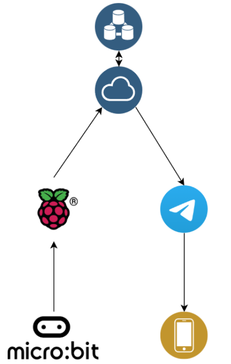

<div id="top"></div>
<div align="center">
  <h1 align="center">PWID Helper Backend</h1>
  <p align="center">
    This project builds on top of the existing Developmental Disablity Registry Identity Card (DDR ID Card) and the Electronic ID done by the ConnectID project team.<br />We aim to improve the PWID's experience to seek help when they are lost in public and reduce the time to respond by responders during such a scenario.<br />Our project strives to achieve that though matching the most suitable responders based on each PWID's personal needs & the responders capabilities, segregating areas of concerns to prevent misuse of personal data, and finally, increase the reach of getting responders by leveraging the internet.
  </p>
</div>

<!-- TABLE OF CONTENTS -->
<details open>
  <summary>Table of Contents</summary>
  <ol>
    <li>
      <a href="#solution-architecture">Solution Architecture</a>
    </li>
    <li>
      <a href="#getting-started">Getting Started</a>
      <ul>
        <li><a href="#prerequisites">Prerequisites</a></li>
        <li><a href="#initial-setup">Initial Setup</a></li>
      </ul>
    </li>
    <li><a href="#development">Development</a></li>
    <li><a href="#testing">Testing</a></li>
    <li><a href="#deployment">Deployment</a></li>
  </ol>
</details>

# Solution Architecture

<div align="center">
    
</div>

<p align="right">(<a href="#top">back to top</a>)</p>

# Getting Started

## Prerequisites

- `Python` == [`v3.11`](https://www.python.org/downloads/release/python-3111/)
- `Pipenv` >= [`v2022.12.19`](https://pipenv.pypa.io/en/latest/)
- [optional] [Makefile](https://www.gnu.org/software/make/manual/make.html) ([Cygwin](https://www.cygwin.com/install.html) `make` if developing on windows)

## Initial Setup

Clone Repository

```bash
git clone git@github.com:SMU-AY202223-CS460G2-5/pwid-helper-backend.git
```

Navigate to the project directory

```bash
cd pwid-helper-backend
```

Activate pipenv shell (virtual environment)

```bash
pipenv shell
```

Install all dependencies, including dev depencies

```bash
pipenv install -d
```

<p align="right">(<a href="#top">back to top</a>)</p>

# Development

This project uses a simple [Flask](https://flask.palletsprojects.com/en/2.2.x/) app to serve as the main backend. The [Telegram Bot API](https://core.telegram.org/bots) is integrated into the Flask app via [webhook](https://core.telegram.org/bots/api#getting-updates).

### Setting up environment

An example of environment variables required is listed under [`.env.example`](.env.example).
To setup the environment:

```bash
make init
```

<ins><em>OR</em></ins>

Copy the file [`.env.example`](.env.example) as a new file named `.env`.

### Running the development server

Before running the server, `.env` is required on the project root. Refer to [setting up environment](#setting-up-environment).

```bash
make dev
```

<ins><em>OR</em></ins>

```bash
python run_dev.py
```

### Adding scripts to [`scripts`](/scripts/)

After adding a script to the directory, run the following to change file mode to executable

```bash
git update-index --chmod=+x ./scripts/<script_name>
```

<p align="right">(<a href="#top">back to top</a>)</p>

# Testing

This project uses [pytest](https://docs.pytest.org/en/7.2.x/) for simple unit testing. Test scripts can be found under the [`./tests`](/tests/) folder.

To test, ensure that the pipenv shell is active then run the following. Refer to [initial setup](#initial-setup).

```bash
make test
```

<ins><em>OR</em></ins>

```bash
pytest tests \
    -o cache_dir=/tmp/.pytest_cache \
    -W ignore::DeprecationWarning \
    --cache-clear \
    -s -v \
    --junitxml=test-results/pytest-result.xml
```

<p align="right">(<a href="#top">back to top</a>)</p>

# Deployment

This project is deployed on [Google Cloud Platform](https://cloud.google.com/) via [Serverless Cloud Functions](https://cloud.google.com/functions/docs/concepts/overview).

<p align="right">(<a href="#top">back to top</a>)</p>
